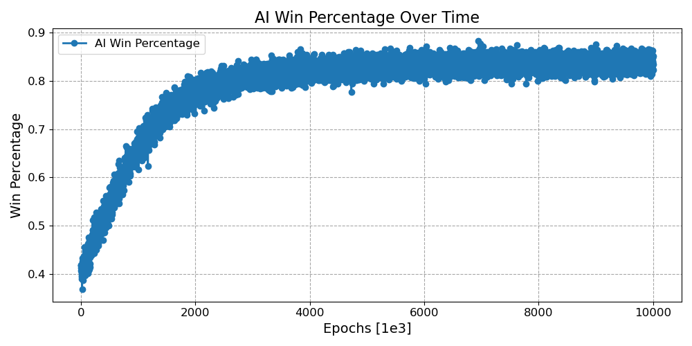
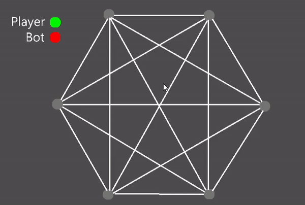

# RL-Agent for the game of Sim

- Two players take turns coloring any uncolored lines. One player colors in one color, and the other colors in another color, with each player trying to avoid the creation of a triangle made solely of their color (only triangles with the dots as all corners count; intersections of lines are not relevant); the player who completes such a triangle loses immediately.  
- See wiki: [Sim-Pencil-Game](https://en.wikipedia.org/wiki/Sim_(pencil_game))

## Training the RL-Agent 

## Playing the Game in Godot Game Engine

